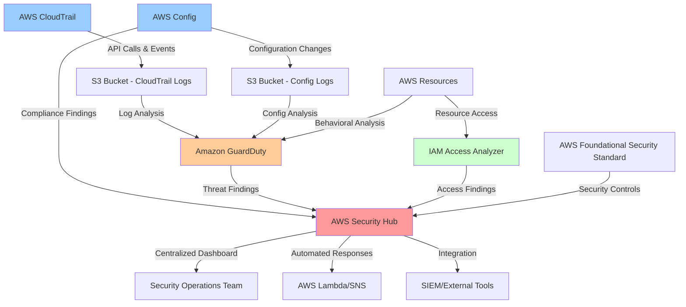

# AWS Security Baseline

A comprehensive Terraform-based solution for establishing a security baseline in AWS using native security services. This project provisions essential security monitoring, threat detection, and compliance auditing services to protect your AWS environment.

## 🎯 Project Overview

Establishing a robust security baseline is crucial for any cloud deployment. This project automates the deployment of AWS native security services that provide:

- **Comprehensive logging and monitoring** across all AWS regions
- **Threat detection and analysis** using machine learning and behavioral analytics
- **Centralized security findings management** for streamlined security operations
- **Configuration compliance monitoring** to ensure adherence to security best practices
- **Access pattern analysis** to identify potential security risks

The Infrastructure as Code (IaC) approach ensures consistent, repeatable, and auditable security configurations across your AWS environments.

## 📁 Project Structure

This project follows Terraform best practices with organized file structure:

```
aws-security-baseline/
├── main.tf                    # Main resource definitions
├── variables.tf               # Input variable declarations
├── outputs.tf                 # Output value definitions
├── versions.tf                # Terraform and provider versions
├── verify_baseline.py         # Python verification script
├── requirements.txt           # Python dependencies
├── terraform.tfvars.example   # Example variable values
├── Makefile                   # Convenience commands
├── README.md                  # Project documentation
└── .gitignore                 # Git ignore patterns
```

### File Organization Benefits

- **main.tf**: Organized by service with clear section headers
- **variables.tf**: Centralized variable definitions with validation
- **outputs.tf**: Comprehensive outputs for service integration
- **versions.tf**: Explicit version constraints for reproducibility

## 🏗️ AWS Security Architecture

The following diagram illustrates how the deployed security services work together to provide comprehensive protection:



### Data Flow

1. **Event Collection**: CloudTrail captures all API calls and management events across all regions
2. **Configuration Monitoring**: AWS Config continuously monitors resource configurations and compliance
3. **Access Analysis**: IAM Access Analyzer examines resource policies for unintended external access
4. **Threat Detection**: GuardDuty analyzes CloudTrail logs, DNS queries, and network traffic for threats
5. **Centralized Aggregation**: Security Hub collects and correlates findings from all security services
6. **Response & Remediation**: Security teams can respond to findings through Security Hub's centralized interface

## 🛡️ Services Deployed

This Terraform configuration deploys and configures the following AWS security services:

### 📊 **AWS CloudTrail**

- **Purpose**: Comprehensive audit logging for AWS API calls and management events
- **Configuration**: Multi-region trail with global service events enabled
- **Features**:
  - Logs stored in encrypted S3 bucket
  - Log file validation enabled
  - Insight events for API call rate analysis
  - Data events for S3 object-level operations

### 🔍 **Amazon GuardDuty**

- **Purpose**: Intelligent threat detection using machine learning and threat intelligence
- **Configuration**: Account-level detector with enhanced data sources
- **Features**:
  - S3 protection for bucket-level threat detection
  - Kubernetes audit logs analysis
  - Malware protection for EC2 instances
  - DNS and network traffic analysis

### 🏢 **AWS Security Hub**

- **Purpose**: Centralized security findings management and compliance monitoring
- **Configuration**: Account-wide hub with default standards enabled
- **Features**:
  - AWS Foundational Security Best Practices standard
  - Automated finding aggregation from GuardDuty and other services
  - Security score calculation
  - Custom insights and dashboards

### ⚙️ **AWS Config**

- **Purpose**: Resource configuration monitoring and compliance auditing
- **Configuration**: Multi-region configuration recorder with managed rules
- **Features**:
  - Continuous configuration monitoring
  - Pre-configured compliance rules:
    - S3 bucket public read access detection
    - Security group unrestricted SSH access detection
  - Configuration history and change notifications

### 🔐 **IAM Access Analyzer**

- **Purpose**: Analyze resource policies to identify unintended external access
- **Configuration**: Account-type analyzer for comprehensive coverage
- **Features**:
  - Cross-account access detection
  - Public access identification
  - Policy validation and recommendations
  - Continuous monitoring of new resources

## � Project Structure

The Terraform configuration is organized into separate files for better maintainability and clarity:

```
aws-security-baseline/
├── versions.tf                # Terraform and provider version constraints
├── variables.tf               # Input variable declarations with validation
├── main.tf                    # Core configuration (provider, data sources, locals)
├── cloudtrail.tf              # CloudTrail logging resources
├── guardduty.tf               # GuardDuty threat detection resources
├── security-hub.tf            # Security Hub centralized findings
├── config.tf                  # AWS Config compliance monitoring
├── access-analyzer.tf         # IAM Access Analyzer resources
├── outputs.tf                 # Output value definitions
├── terraform.tfvars.example   # Example variable configuration
├── verify_baseline.py         # Python verification script
├── requirements.txt           # Python dependencies
├── Makefile                   # Convenience commands
├── README.md                  # This documentation
└── .gitignore                 # Git ignore patterns
```

### File Organization Benefits

- **🎯 Single Responsibility**: Each file focuses on one AWS service
- **🔍 Easy Navigation**: Quickly find and modify specific service configurations
- **🚀 Better Collaboration**: Team members can work on different services simultaneously
- **📋 Simplified Reviews**: Changes are easier to review and understand
- **🔧 Modular Maintenance**: Update one service without affecting others

## �🚀 How to Use

### Prerequisites

Before deploying this security baseline, ensure you have:

- AWS CLI configured with appropriate credentials
- Terraform >= 1.0 installed
- Python 3.7+ and pip (for the verification script)
- Appropriate AWS permissions for the services being deployed

### Step 1: Configure AWS Credentials

Set up your AWS credentials using one of these methods:

```bash
# Option 1: AWS CLI
aws configure

# Option 2: Environment variables
export AWS_ACCESS_KEY_ID="your-access-key"
export AWS_SECRET_ACCESS_KEY="your-secret-key"
export AWS_DEFAULT_REGION="us-east-1"

# Option 3: Use IAM role (if running on EC2)
# No additional configuration needed
```

### Step 2: Initialize and Deploy Terraform

```bash
# Navigate to the project directory
cd aws-security-baseline

# Initialize Terraform
terraform init

# Review the planned changes
terraform plan

# Deploy the security baseline
terraform apply
```

**Note**: The deployment may take 5-10 minutes as AWS provisions and configures the security services.

### Step 3: Verify Service Status

Run the Python verification script to confirm all services are properly enabled:

```bash
# Install required Python dependencies
pip install boto3

# Run the verification script
python verify_baseline.py

# For specific region (optional)
python verify_baseline.py --region us-west-2

# Get JSON output for automation (optional)
python verify_baseline.py --json
```

### Step 4: Access Security Services

After successful deployment, you can access the security services through the AWS Console:

- **Security Hub**: [AWS Security Hub Console](https://console.aws.amazon.com/securityhub/)
- **GuardDuty**: [Amazon GuardDuty Console](https://console.aws.amazon.com/guardduty/)
- **CloudTrail**: [AWS CloudTrail Console](https://console.aws.amazon.com/cloudtrail/)
- **Config**: [AWS Config Console](https://console.aws.amazon.com/config/)
- **Access Analyzer**: [IAM Access Analyzer Console](https://console.aws.amazon.com/access-analyzer/)

## 📋 Expected Output

### Terraform Apply Success

```
Apply complete! Resources: 15 added, 0 changed, 0 destroyed.

Outputs:

access_analyzer_arn = "arn:aws:access-analyzer:us-east-1:123456789012:analyzer/aws-security-baseline-access-analyzer"
cloudtrail_arn = "arn:aws:cloudtrail:us-east-1:123456789012:trail/aws-security-baseline-trail"
config_recorder_name = "aws-security-baseline-config-recorder"
guardduty_detector_id = "12abc34def567890"
security_hub_arn = "arn:aws:securityhub:us-east-1:123456789012:hub/default"
```

### Verification Script Success

```
🔍 AWS Security Baseline Verification
Account ID: 123456789012
Region: us-east-1
============================================================

📋 Checking GuardDuty...
✅ GuardDuty: ENABLED

📋 Checking Security Hub...
✅ Security Hub: ACTIVE

📋 Checking IAM Access Analyzer...
✅ IAM Access Analyzer: 1 active analyzer(s) found

📋 Checking CloudTrail...
✅ CloudTrail: 1 active multi-region trail(s) found

📋 Checking AWS Config...
✅ AWS Config: 1 active recorder(s) found

============================================================
📊 Summary: 5/5 services enabled
🎉 All security baseline services are enabled!
```

## 🔧 Customization

### Variables

You can customize the deployment by modifying variables in `main.tf`:

```hcl
variable "aws_region" {
  description = "AWS region for resources"
  default     = "us-east-1"  # Change to your preferred region
}

variable "environment" {
  description = "Environment name"
  default     = "production"  # Customize for your environment
}

variable "project_name" {
  description = "Project name for resource naming"
  default     = "my-security-baseline"  # Customize naming
}
```

### Adding Additional Config Rules

You can add more AWS Config rules by adding additional `aws_config_config_rule` resources:

```hcl
resource "aws_config_config_rule" "root_access_key_check" {
  name = "root-access-key-check"

  source {
    owner             = "AWS"
    source_identifier = "ROOT_ACCESS_KEY_CHECK"
  }

  depends_on = [aws_config_configuration_recorder.main]
}
```

## 💰 Cost Considerations

This security baseline incurs costs for:

- **CloudTrail**: Data events and management events
- **GuardDuty**: Per-account and per-GB analyzed
- **Security Hub**: Per finding and per compliance check
- **Config**: Per configuration item and per rule evaluation
- **S3 Storage**: For CloudTrail and Config logs
- **Access Analyzer**: No additional charges

Estimated monthly cost for a small environment: $20-50 USD

## 🧹 Cleanup

To remove all deployed resources:

```bash
terraform destroy
```

**Warning**: This will delete all security monitoring and logs. Ensure you have backups of any important security data.

## 📚 Additional Resources

- [AWS Security Best Practices](https://aws.amazon.com/architecture/security-identity-compliance/)
- [AWS Well-Architected Security Pillar](https://docs.aws.amazon.com/wellarchitected/latest/security-pillar/welcome.html)
- [AWS Security Hub User Guide](https://docs.aws.amazon.com/securityhub/latest/userguide/)
- [Amazon GuardDuty User Guide](https://docs.aws.amazon.com/guardduty/latest/ug/)
- [AWS CloudTrail User Guide](https://docs.aws.amazon.com/cloudtrail/latest/userguide/)

## 🤝 Contributing

Contributions are welcome! Please feel free to submit pull requests or create issues for bugs and feature requests.

## 📄 License

This project is licensed under the MIT License - see the LICENSE file for details.
