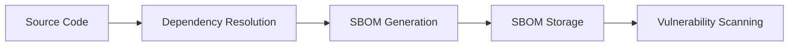
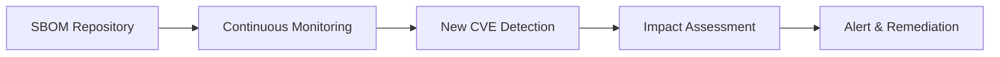
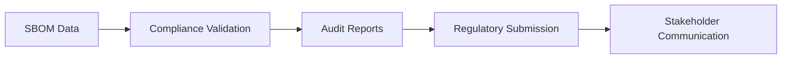

# SBOM (Software Bill of Materials) Guide

## 📋 What is SBOM?

A **Software Bill of Materials (SBOM)** is a comprehensive inventory of all software components, libraries, and dependencies used in building a software application. Think of it as an "ingredient list" for your software.

### 🎯 **Why SBOM Matters:**

- **Transparency:** Know exactly what's in your software
- **Security:** Quickly identify vulnerable components
- **Compliance:** Meet regulatory requirements (e.g., Executive Order 14028)
- **Risk Management:** Understand your software supply chain risks
- **Incident Response:** Rapidly assess impact of newly discovered vulnerabilities

---

## 🏗️ SBOM Standards & Formats

### 1. **CycloneDX**

```json
{
  "bomFormat": "CycloneDX",
  "specVersion": "1.4",
  "serialNumber": "urn:uuid:12345678-1234-1234-1234-123456789abc",
  "version": 1,
  "components": [
    {
      "type": "library",
      "name": "flask",
      "version": "2.3.2",
      "purl": "pkg:pypi/flask@2.3.2"
    }
  ]
}
```

**Features:**

- Open-source, vendor-neutral standard
- Supports multiple formats (JSON, XML, Protocol Buffers)
- Rich metadata including licenses, vulnerabilities, and relationships
- Strong tooling ecosystem
- **Best for:** Modern DevSecOps pipelines

### 2. **SPDX (Software Package Data Exchange)**

```json
{
  "spdxVersion": "SPDX-2.3",
  "dataLicense": "CC0-1.0",
  "SPDXID": "SPDXRef-DOCUMENT",
  "name": "flask-app-sbom",
  "packages": [
    {
      "SPDXID": "SPDXRef-Package-flask",
      "name": "flask",
      "versionInfo": "2.3.2"
    }
  ]
}
```

**Features:**

- ISO/IEC 5962:2021 standard
- Strong legal and licensing focus
- Government and enterprise adoption
- **Best for:** Compliance-heavy environments

### 3. **SWID (Software Identification Tags)**

- XML-based format
- Focused on installed software identification
- **Best for:** Asset management and inventory

---

## 🔍 Vulnerability Databases & Standards

### 1. **CVE (Common Vulnerabilities and Exposures)**

- **What:** Standardized identifiers for known security vulnerabilities
- **Format:** CVE-YYYY-NNNN (e.g., CVE-2023-1234)
- **Managed by:** MITRE Corporation
- **Usage:** Universal reference for security vulnerabilities

```bash
# Example CVE entry
CVE-2023-40217: TLS handshake bypass in Python's ssl module
CVSS Score: 5.3 (Medium)
Affected: Python < 3.8.18, 3.9.x < 3.9.18, 3.10.x < 3.10.13
```

### 2. **NVD (National Vulnerability Database)**

- **What:** US government repository of standards-based vulnerability data
- **Managed by:** NIST (National Institute of Standards and Technology)
- **Features:**
  - CVE descriptions and impact scores
  - CVSS (Common Vulnerability Scoring System) ratings
  - CPE (Common Platform Enumeration) identifiers
  - Remediation guidance

### 2.1. **CPE (Common Platform Enumeration)**

**What is CPE?**
CPE is a standardized method for describing and identifying classes of applications, operating systems, and hardware devices present among an enterprise's computing assets.

**CPE Format:**

```
cpe:/{part}:{vendor}:{product}:{version}:{update}:{edition}:{language}
```

**CPE Examples:**

```bash
# Python application
cpe:/a:python:python:3.11.0

# Flask framework
cpe:/a:pallets:flask:2.3.2

# Ubuntu operating system
cpe:/o:canonical:ubuntu_linux:22.04

# Docker container
cpe:/a:docker:docker:24.0.5
```

**CPE Components Explained:**

- **Part:** `a` (application), `o` (operating system), `h` (hardware)
- **Vendor:** Organization that created the product (e.g., `python`, `pallets`, `canonical`)
- **Product:** Name of the product (e.g., `python`, `flask`, `ubuntu_linux`)
- **Version:** Version number (e.g., `3.11.0`, `2.3.2`, `22.04`)
- **Update:** Update version or patch level
- **Edition:** Target user base (e.g., `pro`, `enterprise`)
- **Language:** Supported language (e.g., `en`, `fr`)

**Why CPE Matters in SBOM:**

1. **Precise Component Identification:** CPE provides unambiguous identification of software components
2. **Vulnerability Matching:** Security tools use CPE to match components with known vulnerabilities
3. **Asset Management:** Enables accurate inventory and tracking of software assets
4. **Compliance:** Required for many security frameworks and standards

**CPE in SBOM Context:**

```json
{
  "bomFormat": "CycloneDX",
  "components": [
    {
      "type": "library",
      "name": "flask",
      "version": "2.3.2",
      "purl": "pkg:pypi/flask@2.3.2",
      "cpe": "cpe:/a:pallets:flask:2.3.2",
      "scope": "required"
    }
  ]
}
```

### 3. **OSV (Open Source Vulnerabilities)**

- **What:** Distributed vulnerability database for open source
- **Managed by:** Google, with community contributions
- **Features:**
  - Precise affected version ranges
  - Automated vulnerability detection
  - Developer-friendly format
  - Real-time updates

```json
{
  "id": "GHSA-xxxx-xxxx-xxxx",
  "summary": "SQL injection in flask-sqlalchemy",
  "affected": [
    {
      "package": {
        "ecosystem": "PyPI",
        "name": "flask-sqlalchemy"
      },
      "ranges": [
        {
          "type": "ECOSYSTEM",
          "events": [{ "introduced": "0" }, { "fixed": "2.5.1" }]
        }
      ]
    }
  ]
}
```

### 4. **GitHub Security Advisories (GHSA)**

- **What:** GitHub's vulnerability database
- **Features:** Community-contributed security advisories
- **Integration:** Direct GitHub ecosystem integration

---

## 🔄 SBOM in DevSecOps Pipeline

### **1. SBOM Generation Stage**

```yaml
# Example GitHub Action for SBOM generation
- name: Generate SBOM
  uses: anchore/sbom-action@v0
  with:
    path: ./
    format: cyclonedx-json
    output-file: sbom.cyclonedx.json
```

**Tools for SBOM Generation:**

- **Syft** (Anchore): Multi-language SBOM generation
- **CycloneDX CLI**: Language-specific generators
- **SPDX Tools**: SPDX format generation
- **Microsoft SBOM Tool**: Cross-platform SBOM generation

### **2. SBOM Storage & Management**

```yaml
# Store SBOM artifacts
- name: Upload SBOM
  uses: actions/upload-artifact@v4
  with:
    name: sbom-cyclonedx
    path: sbom.cyclonedx.json
```

### **3. Vulnerability Scanning with SBOM**

```yaml
# Scan SBOM for vulnerabilities
- name: Scan SBOM
  uses: anchore/scan-action@v3
  with:
    sbom: sbom.cyclonedx.json
    fail-build: true
    severity-cutoff: high
```

---

## 🛡️ SBOM-Driven Security Workflow

### **Phase 1: Build-Time SBOM Generation**



#### **Phase 1 Detailed Breakdown:**

**Step 1: Source Code Analysis**

- **Purpose:** Identify all source files and direct dependencies
- **Open-Source Tools:**
  - **Syft:** Multi-language source code analysis
  - **CycloneDX CLI:** Language-specific SBOM generators
  - **SPDX Tools:** SPDX-format SBOM generation
  - **Tern:** Container-focused analysis

**Step 2: Dependency Resolution**

- **Purpose:** Map complete dependency tree including transitive dependencies
- **Open-Source Tools:**
  - **pip-tools (Python):** Dependency resolution and lock files
  - **npm audit (Node.js):** Package vulnerability auditing
  - **Gradle dependency-check (Java):** OWASP dependency checker
  - **Cargo audit (Rust):** Security audit for Rust dependencies

**Step 3: SBOM Generation**

- **Purpose:** Create standardized inventory of all components
- **Open-Source Tools:**
  - **Syft:** `syft packages dir:. -o cyclonedx-json`
  - **CycloneDX Python:** `cyclonedx-py -r requirements.txt`
  - **Microsoft SBOM Tool:** Cross-platform SBOM generation
  - **FOSSA CLI:** License and vulnerability analysis

**Step 4: SBOM Storage & Versioning**

- **Purpose:** Store SBOMs with proper versioning and metadata
- **Open-Source Tools:**
  - **Git:** Version control for SBOM files
  - **Artifactory Community:** Artifact repository
  - **Nexus Repository OSS:** Component repository manager
  - **Harbor:** Container registry with SBOM support

**Step 5: Build-Time Vulnerability Scanning**

- **Purpose:** Immediate feedback on security issues
- **Open-Source Tools:**
  - **Grype:** `grype sbom:sbom.json --fail-on high`
  - **Trivy:** `trivy sbom sbom.json --severity HIGH,CRITICAL`
  - **OSV Scanner:** `osv-scanner --sbom sbom.json`
  - **Nancy (Go):** Dependency vulnerability scanner

### **Phase 2: Runtime Vulnerability Monitoring**



#### **Phase 2 Detailed Breakdown:**

**Step 1: SBOM Repository Management**

- **Purpose:** Centralized storage and management of all SBOMs
- **Open-Source Tools:**
  - **Dependency-Track:** SBOM analysis and vulnerability management platform
  - **SW360:** Software component lifecycle management
  - **FOSSA:** Open-source license and vulnerability management
  - **WhiteSource (now Mend) Community:** Basic vulnerability monitoring

```bash
# Dependency-Track setup example
docker run -d -p 8080:8080 --name dependency-track \
  -v dependency-track-data:/data \
  dependencytrack/bundled:latest
```

**Step 2: Continuous Vulnerability Monitoring**

- **Purpose:** Monitor for new vulnerabilities affecting stored SBOMs
- **Open-Source Tools:**
  - **Dependency-Track:** Continuous monitoring with REST API
  - **OSV.dev API:** Real-time vulnerability database queries
  - **GitHub Security Advisories API:** Community vulnerability data
  - **VulnDB Community:** Vulnerability intelligence feeds

```bash
# OSV API monitoring example
curl -X POST "https://api.osv.dev/v1/querybatch" \
  -H "Content-Type: application/json" \
  -d @sbom-query.json
```

**Step 3: New CVE Detection & Correlation**

- **Purpose:** Automatically detect when new vulnerabilities affect your components
- **Open-Source Tools:**
  - **CVE Binary Tool:** `cve-bin-tool --sbom sbom.json`
  - **Vulners Scanner:** Multi-source vulnerability correlation
  - **Nuclei:** Vulnerability scanner with CVE templates
  - **Custom Scripts:** Using NVD/OSV APIs

```python
# Example Python script for CVE monitoring
import requests
import json

def check_new_cves(sbom_file):
    with open(sbom_file) as f:
        sbom = json.load(f)

    for component in sbom['components']:
        # Query OSV database for component
        response = requests.post(
            'https://api.osv.dev/v1/query',
            json={
                'package': {
                    'ecosystem': 'PyPI',
                    'name': component['name']
                },
                'version': component['version']
            }
        )
        vulnerabilities = response.json().get('vulns', [])
        if vulnerabilities:
            print(f"⚠️  {component['name']}@{component['version']}: {len(vulnerabilities)} vulnerabilities")
```

**Step 4: Impact Assessment & Risk Scoring**

- **Purpose:** Evaluate the business impact and prioritize remediation
- **Open-Source Tools:**
  - **CVSS Calculator:** Risk scoring based on CVSS v3.1
  - **Dependency-Track:** Risk assessment with configurable rules
  - **DefectDojo:** Vulnerability management with risk tracking
  - **Security Scorecards:** OpenSSF project health scoring

```bash
# Risk assessment with custom scoring
grype sbom:sbom.json -o json | jq '.matches[] | select(.vulnerability.severity == "High") | .vulnerability.id'
```

**Step 5: Automated Alerting & Remediation**

- **Purpose:** Notify teams and trigger remediation workflows
- **Open-Source Tools:**
  - **AlertManager (Prometheus):** Alert routing and management
  - **Grafana:** Vulnerability dashboards and notifications
  - **Slack/Teams Webhooks:** Real-time team notifications
  - **GitHub Issues API:** Automated issue creation
  - **Jenkins/GitLab CI:** Automated remediation pipelines

```yaml
# Example GitHub Action for automated alerts
name: Vulnerability Alert
on:
  schedule:
    - cron: "0 6 * * *" # Daily at 6 AM

jobs:
  scan:
    runs-on: ubuntu-latest
    steps:
      - uses: actions/checkout@v4

      - name: Scan for new vulnerabilities
        run: |
          grype sbom:sbom.json -o json > scan-results.json

      - name: Create issue for high-severity vulnerabilities
        uses: actions/github-script@v7
        with:
          script: |
            const fs = require('fs');
            const results = JSON.parse(fs.readFileSync('scan-results.json'));
            const highSeverity = results.matches.filter(m => m.vulnerability.severity === 'High');

            if (highSeverity.length > 0) {
              await github.rest.issues.create({
                owner: context.repo.owner,
                repo: context.repo.repo,
                title: `🚨 High-severity vulnerabilities detected: ${highSeverity.length} issues`,
                body: `Automated scan found ${highSeverity.length} high-severity vulnerabilities.\n\nPlease review and remediate.`,
                labels: ['security', 'vulnerability', 'high-priority']
              });
            }
```

### **Phase 3: Compliance & Reporting**



#### **Phase 3 Detailed Breakdown:**

**Step 1: Compliance Validation**

- **Purpose:** Ensure SBOMs meet regulatory and industry standards
- **Open-Source Tools:**
  - **CycloneDX Validator:** `cyclonedx validate --input-file sbom.json`
  - **SPDX Validator:** Format and content validation
  - **Custom Compliance Scripts:** Business-specific validation rules
  - **Policy-as-Code Tools:** OPA (Open Policy Agent) for compliance policies

**Step 2: Automated Audit Reports**

- **Purpose:** Generate compliance reports for auditors and stakeholders
- **Open-Source Tools:**
  - **Dependency-Track Reports:** Built-in reporting capabilities
  - **Jupyter Notebooks:** Custom analysis and reporting
  - **R/Python Scripts:** Statistical analysis and visualization
  - **Grafana Dashboards:** Real-time compliance metrics

**Step 3: License Compliance Monitoring**

- **Purpose:** Track and manage open-source license obligations
- **Open-Source Tools:**
  - **FOSSA CLI:** License analysis and compliance
  - **LicenseFinder:** Multi-language license detection
  - **FOSSology:** License scanner and compliance workflow
  - **ScanCode Toolkit:** License and copyright detection

```bash
# License compliance workflow
scancode -clpieu --json-pp license-scan.json ./src
fossa analyze --debug
licensefinder --decisions-file decisions.yml
```

### **Complete Workflow Integration Example**

```yaml
# .github/workflows/sbom-security-workflow.yml
name: SBOM-Driven Security Workflow

on:
  push:
    branches: [main]
  pull_request:
    branches: [main]
  schedule:
    - cron: "0 2 * * *" # Daily monitoring

jobs:
  generate-sbom:
    name: Generate SBOM
    runs-on: ubuntu-latest
    outputs:
      sbom-artifact: ${{ steps.upload.outputs.artifact-id }}

    steps:
      - uses: actions/checkout@v4

      - name: Setup Python
        uses: actions/setup-python@v4
        with:
          python-version: "3.11"

      - name: Install dependencies
        run: |
          pip install cyclonedx-bom

      - name: Generate Python SBOM
        run: |
          cyclonedx-py -r requirements.txt -o sbom-python.json

      - name: Generate Container SBOM
        uses: anchore/sbom-action@v0
        with:
          path: ./
          format: cyclonedx-json
          output-file: sbom-container.json

      - name: Merge SBOMs
        run: |
          # Combine SBOMs (simplified example)
          jq -s 'add' sbom-python.json sbom-container.json > sbom-complete.json

      - name: Upload SBOM
        id: upload
        uses: actions/upload-artifact@v4
        with:
          name: sbom-cyclonedx
          path: sbom-complete.json

  vulnerability-scan:
    name: Vulnerability Scan
    runs-on: ubuntu-latest
    needs: generate-sbom

    steps:
      - name: Download SBOM
        uses: actions/download-artifact@v4
        with:
          name: sbom-cyclonedx

      - name: Install Grype
        run: |
          curl -sSfL https://raw.githubusercontent.com/anchore/grype/main/install.sh | sh -s -- -b /usr/local/bin

      - name: Scan for vulnerabilities
        run: |
          grype sbom:sbom-complete.json -o sarif > vulnerabilities.sarif
          grype sbom:sbom-complete.json -o json > vulnerabilities.json

      - name: Upload vulnerability results
        uses: github/codeql-action/upload-sarif@v3
        with:
          sarif_file: vulnerabilities.sarif

      - name: Check for critical vulnerabilities
        run: |
          CRITICAL_COUNT=$(jq '.matches[] | select(.vulnerability.severity == "Critical") | length' vulnerabilities.json | wc -l)
          if [ "$CRITICAL_COUNT" -gt 0 ]; then
            echo "❌ Critical vulnerabilities found: $CRITICAL_COUNT"
            exit 1
          fi

  continuous-monitoring:
    name: Continuous Monitoring
    runs-on: ubuntu-latest
    needs: [generate-sbom, vulnerability-scan]
    if: github.event_name == 'schedule'

    steps:
      - name: Download SBOM
        uses: actions/download-artifact@v4
        with:
          name: sbom-cyclonedx

      - name: OSV Scanner
        run: |
          curl -L https://github.com/google/osv-scanner/releases/latest/download/osv-scanner_linux_amd64 -o osv-scanner
          chmod +x osv-scanner
          ./osv-scanner --sbom sbom-complete.json --format json > osv-results.json

      - name: Create security issues
        uses: actions/github-script@v7
        with:
          script: |
            const fs = require('fs');
            const osvResults = JSON.parse(fs.readFileSync('osv-results.json'));

            if (osvResults.results && osvResults.results.length > 0) {
              const newVulns = osvResults.results.filter(r => r.packages && r.packages.length > 0);
              
              if (newVulns.length > 0) {
                await github.rest.issues.create({
                  owner: context.repo.owner,
                  repo: context.repo.repo,
                  title: `🔍 New vulnerabilities detected in daily scan`,
                  body: `Daily vulnerability scan found ${newVulns.length} new security issues.\n\nPlease review the security tab for details.`,
                  labels: ['security', 'automated-scan']
                });
              }
            }
```

---

## 🔧 Implementing SBOM in Our Pipeline

### **Enhanced GitHub Actions Workflow:**

```yaml
sbom-generation:
  name: Generate & Scan SBOM
  runs-on: ubuntu-latest
  needs: build

  steps:
    - name: Checkout code
      uses: actions/checkout@v4

    - name: Generate Python SBOM
      run: |
        pip install cyclonedx-bom
        cyclonedx-py -r requirements.txt -o sbom-python.json

    - name: Generate Container SBOM
      uses: anchore/sbom-action@v0
      with:
        image: ${{ env.REGISTRY }}/${{ env.IMAGE_NAME }}:latest
        format: cyclonedx-json
        output-file: sbom-container.json

    - name: Merge SBOMs
      run: |
        # Combine application and container SBOMs
        cyclonedx merge --input-files sbom-python.json sbom-container.json --output-file sbom-complete.json

    - name: Vulnerability Scan via SBOM
      uses: anchore/scan-action@v3
      with:
        sbom: sbom-complete.json
        fail-build: true
        severity-cutoff: high

    - name: Upload SBOM Artifacts
      uses: actions/upload-artifact@v4
      with:
        name: software-bill-of-materials
        path: |
          sbom-*.json
          scan-results.sarif
```

---

## 📊 SBOM Tools Comparison

| Tool               | Format Support  | Languages         | Container Support | Vulnerability Integration |
| ------------------ | --------------- | ----------------- | ----------------- | ------------------------- |
| **Syft**           | CycloneDX, SPDX | Multi-language    | ✅ Excellent      | Grype integration         |
| **CycloneDX CLI**  | CycloneDX       | Language-specific | ❌ Limited        | ✅ Native                 |
| **SPDX Tools**     | SPDX            | Multi-language    | ✅ Good           | ❌ External               |
| **Microsoft SBOM** | SPDX            | Multi-language    | ✅ Good           | ❌ External               |
| **Tern**           | SPDX, CycloneDX | Container-focused | ✅ Excellent      | ❌ External               |

---

## 🎯 SBOM Best Practices

### **1. Generation Strategy**

- Generate SBOMs at multiple stages (build, deployment, runtime)
- Include both direct and transitive dependencies
- Capture container base image components
- Store SBOMs alongside artifacts

### **2. Vulnerability Management**

- Automate SBOM-based vulnerability scanning
- Set up continuous monitoring for new CVEs
- Implement severity-based response workflows
- Track remediation efforts

### **3. Compliance & Governance**

- Establish SBOM quality standards
- Implement SBOM validation in CI/CD
- Maintain SBOM versioning and lineage
- Regular SBOM audits and reviews

---

## Local SBOM Generation Examples

### **Prerequisites**

```bash
# Install Python tools
pip install cyclonedx-bom

# Install Syft (SBOM generation tool)
# Option 1: Using curl (recommended)
curl -sSfL https://raw.githubusercontent.com/anchore/syft/main/install.sh | sh -s -- -b /usr/local/bin

# Option 2: Using Homebrew (macOS)
brew install syft

# Option 3: Download binary manually
# Visit: https://github.com/anchore/syft/releases

# Install Grype (vulnerability scanner)
# Option 1: Using curl (recommended)
curl -sSfL https://raw.githubusercontent.com/anchore/grype/main/install.sh | sh -s -- -b /usr/local/bin

# Option 2: Using Homebrew (macOS)
brew install grype

# Option 3: Download binary manually
# Visit: https://github.com/anchore/grype/releases

# Verify installations
syft version
grype version
cyclonedx-py --help
```

### **1. Python Application SBOM**

#### **Using CycloneDX Python Tool:**

```bash
# Navigate to your project directory
cd devsecops-pipeline

# Generate SBOM from requirements.txt
cyclonedx-py -r requirements.txt -o sbom-python.json

# Generate SBOM with additional metadata
cyclonedx-py -r requirements.txt \
  --format json \
  --output-file sbom-detailed.json \
  --schema-version 1.4

# View the generated SBOM
cat sbom-python.json | jq '.'
```

#### **Using Syft:**

```bash
# Generate SBOM for Python project
syft packages dir:. -o cyclonedx-json=sbom-syft.json

# Generate with detailed output
syft packages dir:. -o cyclonedx-json=sbom-syft.json -v

# Multiple format generation
syft packages dir:. -o cyclonedx-json=sbom.json -o spdx-json=sbom.spdx.json
```

### **2. Container/Docker SBOM**

#### **Using Syft for Container Images:**

```bash
# Build your Docker image first
docker build -t flask-app:latest .

# Generate SBOM from container image
syft packages flask-app:latest -o cyclonedx-json=sbom-container.json

# Scan remote image
syft packages python:3.11-slim -o cyclonedx-json=sbom-base-image.json

# Generate SBOM with vulnerability data
syft packages flask-app:latest -o cyclonedx-json=sbom-vuln.json --include-vulnerabilities
```

#### **Using Docker SBOM Plugin:**

```bash
# Install Docker SBOM plugin
docker buildx install

# Generate SBOM during build
docker buildx build --sbom=true --output type=local,dest=./sbom-output .

# Generate SBOM for existing image
docker sbom flask-app:latest --format cyclonedx-json > sbom-docker.json
```

### **3. Vulnerability Scanning with SBOM**

#### **Using Grype:**

```bash
# Scan SBOM file for vulnerabilities
grype sbom:sbom-python.json

# Scan with specific output format
grype sbom:sbom-python.json -o json > vulnerabilities.json

# Scan with severity filtering
grype sbom:sbom-python.json --fail-on medium

# Scan container SBOM
grype sbom:sbom-container.json -o sarif > container-vulns.sarif
```

#### **Using Trivy with SBOM:**

```bash
# Scan SBOM file
trivy sbom sbom-python.json

# Scan with specific format
trivy sbom sbom-python.json --format json --output trivy-results.json

# Scan with severity filtering
trivy sbom sbom-python.json --severity HIGH,CRITICAL
```

### **4. SBOM Validation & Analysis**

#### **SBOM Quality Check:**

```bash
# Validate CycloneDX SBOM
cyclonedx validate --input-file sbom-python.json

# Check SBOM statistics
syft packages sbom-python.json -o table

# Convert between formats
cyclonedx convert --input-file sbom-python.json --output-format spdx-json --output-file sbom.spdx.json
```

#### **SBOM Diff and Comparison:**

```bash
# Compare two SBOMs
syft diff sbom-v1.json sbom-v2.json

# Show only additions
syft diff sbom-v1.json sbom-v2.json --output added

# Generate diff report
syft diff sbom-v1.json sbom-v2.json -o json > sbom-diff.json
```

### **5. Complete Local Workflow Example**

#### **Script: `generate-sbom.sh`**

```bash
#!/bin/bash

echo "🔍 Generating SBOM for Flask Application..."

# Create output directory
mkdir -p sbom-output

# 1. Generate Python dependencies SBOM
echo "📦 Generating Python dependencies SBOM..."
cyclonedx-py -r requirements.txt -o sbom-output/python-deps.json

# 2. Generate application source SBOM
echo "📋 Generating application source SBOM..."
syft packages dir:. -o cyclonedx-json=sbom-output/source-code.json

# 3. Build Docker image
echo "🐳 Building Docker image..."
docker build -t flask-app:latest .

# 4. Generate container SBOM
echo "📦 Generating container SBOM..."
syft packages flask-app:latest -o cyclonedx-json=sbom-output/container.json

# 5. Scan for vulnerabilities
echo "🔍 Scanning for vulnerabilities..."
grype sbom:sbom-output/python-deps.json -o json > sbom-output/python-vulns.json
grype sbom:sbom-output/container.json -o json > sbom-output/container-vulns.json

# 6. Generate summary report
echo "📊 Generating summary report..."
echo "SBOM Generation Complete!" > sbom-output/report.txt
echo "Files generated:" >> sbom-output/report.txt
ls -la sbom-output/ >> sbom-output/report.txt

echo "✅ SBOM generation complete! Check sbom-output/ directory"
```

#### **Usage:**

```bash
# Make script executable
chmod +x generate-sbom.sh

# Run the complete workflow
./generate-sbom.sh

# View results
ls -la sbom-output/
cat sbom-output/report.txt
```

### **6. Integration with Git Hooks**

#### **Pre-commit Hook Example:**

```bash
# .git/hooks/pre-commit
#!/bin/bash

echo "🔍 Generating SBOM before commit..."

# Generate fresh SBOM
cyclonedx-py -r requirements.txt -o sbom.json

# Check for high-severity vulnerabilities
if grype sbom:sbom.json --fail-on high; then
    echo "✅ No high-severity vulnerabilities found"
    git add sbom.json
else
    echo "❌ High-severity vulnerabilities detected!"
    echo "Please review and fix before committing"
    exit 1
fi
```

### **7. Local SBOM Server Setup**

#### **Simple SBOM Repository:**

```bash
# Create SBOM storage directory
mkdir -p sbom-repo

# Store SBOMs with timestamps
cp sbom-python.json "sbom-repo/flask-app-$(date +%Y%m%d-%H%M%S).json"

# Create index
ls sbom-repo/ > sbom-repo/index.txt

# Simple HTTP server for SBOM access
cd sbom-repo
python -m http.server 8080
# Access at http://localhost:8080
```

---

## Future Integration Opportunities

### **1. Supply Chain Security**

- SBOM attestation and signing
- Dependency provenance tracking
- Software supply chain risk scoring

### **2. Runtime Security**

- Runtime SBOM generation and comparison
- Drift detection between build and runtime
- Dynamic vulnerability assessment

### **3. Compliance Automation**

- Automated compliance reporting
- License compliance checking
- Export control and regulation adherence

---

## 📚 Additional Resources

- [CISA SBOM Guide](https://www.cisa.gov/sbom)
- [CycloneDX Specification](https://cyclonedx.org/)
- [SPDX Specification](https://spdx.dev/)
- [NIST SSDF Guidelines](https://csrc.nist.gov/Projects/ssdf)
- [Executive Order 14028](https://www.whitehouse.gov/briefing-room/presidential-actions/2021/05/12/executive-order-on-improving-the-nations-cybersecurity/)

---

**Last Updated:** August 29, 2025  
**Next Review:** TBD
