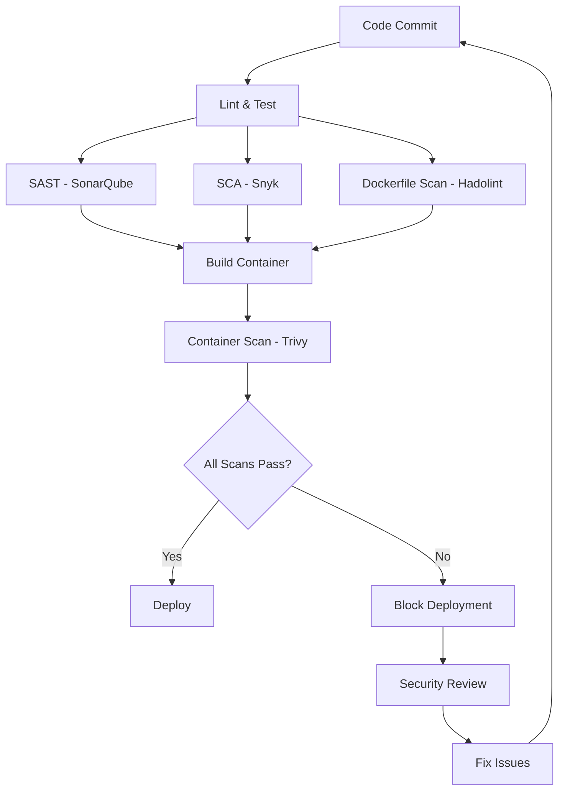

# Security Tools Documentation Index

## 📚 Complete Guide to DevSecOps Security Tools

This documentation provides comprehensive guides for understanding, configuring, and troubleshooting the security tools integrated into our DevSecOps pipeline.

## 📋 Documentation Structure

### 🔍 Tool-Specific Guides

| Tool                              | Purpose                                    | Documentation                     | Key Features                                          |
| --------------------------------- | ------------------------------------------ | --------------------------------- | ----------------------------------------------------- |
| [SonarQube](./sonarqube-guide.md) | Static Application Security Testing (SAST) | Complete setup and analysis guide | Code quality, security vulnerabilities, quality gates |
| [Snyk](./snyk-guide.md)           | Software Composition Analysis (SCA)        | Dependency vulnerability scanning | CVE detection, license compliance, remediation        |
| [Trivy](./trivy-guide.md)         | Container & Infrastructure Security        | Multi-target security scanner     | Container images, filesystems, IaC scanning           |
| [Hadolint](./hadolint-guide.md)   | Dockerfile Security & Linting              | Dockerfile best practices         | Security rules, optimization, shell analysis          |

### 🛠️ Practical Guides

| Guide                                               | Purpose                                   | Use Case                                              |
| --------------------------------------------------- | ----------------------------------------- | ----------------------------------------------------- |
| [Troubleshooting Guide](./troubleshooting-guide.md) | Issue resolution and emergency procedures | When security scans fail or vulnerabilities are found |

## 🚀 Quick Start by Use Case

### "I need to understand what each tool does"

1. Start with [SonarQube Guide](./sonarqube-guide.md#what-is-sonarqube) - Learn about SAST
2. Read [Snyk Guide](./snyk-guide.md#what-is-snyk) - Understand SCA
3. Review [Trivy Guide](./trivy-guide.md#what-is-trivy) - Container security
4. Check [Hadolint Guide](./hadolint-guide.md#what-is-hadolint) - Dockerfile security

### "My pipeline is failing with security issues"

1. **Start here**: [Troubleshooting Guide](./troubleshooting-guide.md) - Common failures and fixes
2. Identify the failing tool and check its specific documentation
3. Follow the step-by-step remediation procedures

### "I want to set up the tools locally"

1. [SonarQube Local Setup](./sonarqube-guide.md#local-setup-and-testing)
2. [Snyk CLI Installation](./snyk-guide.md#local-setup-and-testing)
3. [Trivy Installation](./trivy-guide.md#local-setup-and-testing)
4. [Hadolint Installation](./hadolint-guide.md#local-setup-and-testing)

### "I need to configure CI/CD integration"

1. [Pipeline Integration Examples](./troubleshooting-guide.md#pipeline-integration-problems)
2. Tool-specific GitHub Actions configuration in each guide
3. [Secrets Configuration](./troubleshooting-guide.md#github-actions-secrets-configuration)

## 🔒 Security Scanning Workflow



## 📊 Vulnerability Severity Matrix

| Severity     | CVSS Score | SonarQube | Snyk     | Trivy    | Hadolint | Action Required    |
| ------------ | ---------- | --------- | -------- | -------- | -------- | ------------------ |
| **CRITICAL** | 9.0-10.0   | Blocker   | Critical | Critical | Error    | Immediate fix      |
| **HIGH**     | 7.0-8.9    | Critical  | High     | High     | Error    | Fix within 24h     |
| **MEDIUM**   | 4.0-6.9    | Major     | Medium   | Medium   | Warning  | Fix within 1 week  |
| **LOW**      | 0.1-3.9    | Minor     | Low      | Low      | Info     | Fix in next sprint |

## 🛡️ Security Best Practices Summary

### Code Security (SonarQube)

- ✅ No SQL injection vulnerabilities
- ✅ No hard-coded credentials
- ✅ Proper input validation
- ✅ Secure cryptographic functions
- ✅ 80%+ test coverage

### Dependency Security (Snyk)

- ✅ No high/critical vulnerabilities
- ✅ License compliance
- ✅ Regular dependency updates
- ✅ Pinned versions in production
- ✅ Monitor for new vulnerabilities

### Container Security (Trivy + Hadolint)

- ✅ Use minimal base images
- ✅ Run as non-root user
- ✅ No secrets in images
- ✅ Regular base image updates
- ✅ Proper health checks

## 🚨 Emergency Response

### Critical Vulnerability Found

1. **Immediate**: Stop deployments
2. **Within 1 hour**: Assess impact and communicate
3. **Within 4 hours**: Deploy emergency fix
4. **Within 24 hours**: Complete post-incident review

### Quick Reference Commands

```bash
# Emergency vulnerability check
snyk test --severity-threshold=critical
trivy image --severity CRITICAL my-app:latest
sonar-scanner -Dsonar.qualitygate.wait=true

# Quick fixes
git checkout -b hotfix/security-fix
# Fix vulnerability
git commit -m "SECURITY: Fix critical vulnerability"
git push origin hotfix/security-fix
```

## 📞 Support Resources

### Documentation

- [Main README](../README.md) - Project overview and setup
- [GitHub Actions Workflow](../.github/workflows/security-pipeline.yml) - Pipeline configuration

### Tool Documentation

- [SonarQube Docs](https://docs.sonarqube.org/)
- [Snyk Docs](https://docs.snyk.io/)
- [Trivy Docs](https://aquasecurity.github.io/trivy/)
- [Hadolint Docs](https://github.com/hadolint/hadolint)

### Community Support

- [SonarQube Community](https://community.sonarsource.com/)
- [Snyk Community](https://community.snyk.io/)
- [Trivy GitHub Issues](https://github.com/aquasecurity/trivy/issues)
- [Hadolint GitHub Issues](https://github.com/hadolint/hadolint/issues)

---

## 💡 Pro Tips

1. **Start Small**: Begin with one tool, understand it well, then add others
2. **Set Appropriate Thresholds**: Don't set quality gates too strict initially
3. **Regular Updates**: Keep tools and databases updated
4. **Team Training**: Ensure team understands each tool's purpose and output
5. **Gradual Implementation**: Implement quality gates gradually to avoid blocking development

## 🔄 Continuous Improvement

- Review security metrics weekly
- Update tool configurations based on team feedback
- Add new security rules as threats evolve
- Regular security training and workshops
- Post-incident analysis and documentation updates

For specific implementation details, examples, and troubleshooting, please refer to the individual tool guides linked above.
